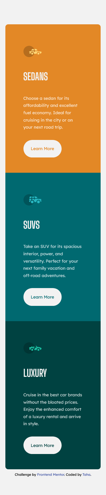

# Frontend Mentor - 3 Column Preview Card Component

This is a solution to the [3 Column Preview Card Component Challenge on Frontend Mentor](https://www.frontendmentor.io/challenges/3column-preview-card-component-pH92eAR2-).

## Table of contents

- [Overview](#overview)
- [The challenge](#the-challenge)
- [Screenshot](#screenshot)
- [Links](#links)
- [Built with](#built-with)
- [Author](#author)

## Overview

### The challenge

Users should be able to:

- View the optimal layout depending on their device's screen size
- See hover states for interactive elements

### Screenshot

### Links

- Solution URL: [Frontend Mentor](https://www.frontendmentor.io/profile/thaykrgl)
- Live Site URL: [Github Pages](https://thaykrgl.github.io/3-column-preview-card-component/)

## My process

### Built with

- Semantic HTML5 markup
- CSS custom properties
- Flexbox
- Mobile-first workflow

## Author

- Linkedin - [Taha](https://www.linkedin.com/in/tahaaykiroglu)
- Frontend Mentor - [@thaykrgl](https://www.frontendmentor.io/profile/thaykrgl)
